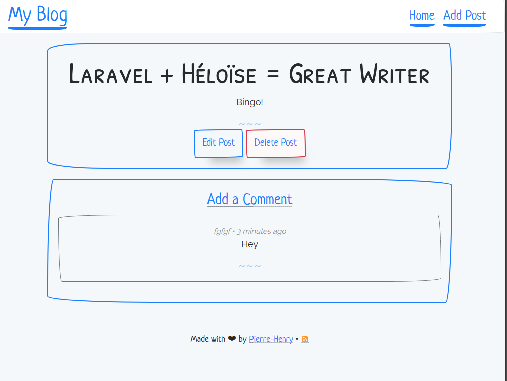
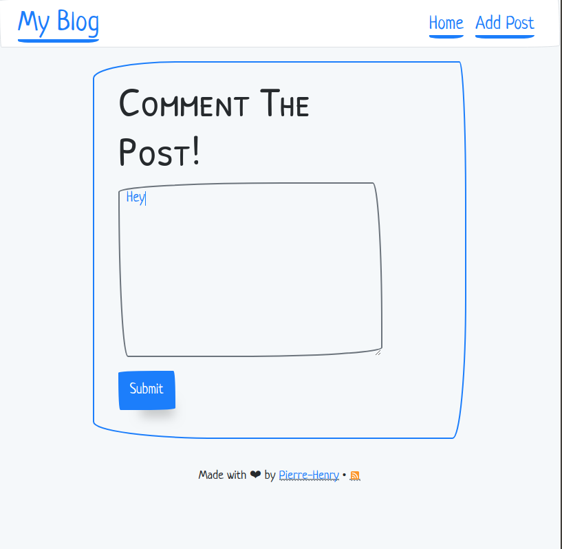

# Héloïse: Simple Laravel Blog

*__Héloïse__ is a simple Blog system with comments and RSS feed. Written on Laravel 5.6 and used PaperCSS and MySQL (or [MongoDB](https://github.com/pH-7/Heloise/tree/mongodb-support) if `mongodb-support` branch is checked out instead of `master`)).*

## Requirements

* [PHP 7.1.3](http://php.net/releases/7_1_3.php) or higher
* [Composer](https://getcomposer.org)
* [Node.js](https://nodejs.org) and NPM

## Author

[Pierre-Henry Soria](http://pierrehenry.be), a Passionate, Zen&Cool Belgian Engineer :belgium: :smiley:

## Setting Up

1. Run `composer install` and Run `npm install` to install the project's dependencies.
2. Rename `.env.example` to `.env` and edit database (and the other details in there).
3. Run `php artisan migrate:fresh --seed` to run the database migrations, with the seeds if needed.
4. Run `npm run production`
5. Start a local development server `php artisan serve`

## How "Héloïse Laravel Blog" Looks Like

